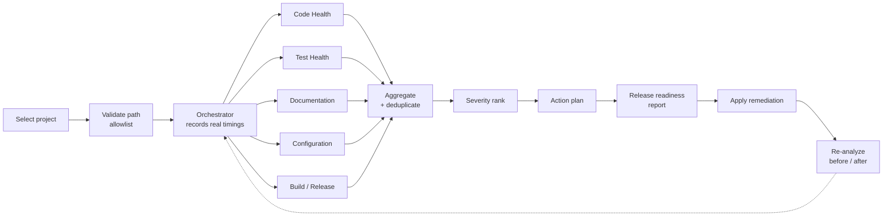

# DevFlow AI

> **IBM Bob 2.0 Hackathon** — Developer Release-Readiness & Maintenance Workflow Assistant

One click instead of a seven-step manual checklist: five analysis modules run in
sequence, their findings are aggregated and severity-ranked, and the result is a
prioritised action plan and a Release Readiness Report — with real measured
timings, not estimates.

## The Problem

Before releasing or maintaining an application, developers perform a repetitive manual checklist:

1. Run the test suite and read through output
2. Scan source files for TODO/FIXME markers
3. Check that README and documentation are complete
4. Verify package.json has required fields and configuration is correct
5. Confirm `.gitignore`, `.env.example`, and other config artifacts are present
6. Run `npm install` to confirm dependency resolution
7. Check for obvious code health issues

Each step is isolated, produces output in a different format, and requires the developer to mentally aggregate findings from multiple tools and windows. The process is slow, error-prone, and produces no unified record of what was found.

## The Solution: DevFlow AI

DevFlow AI coordinates five specialized analysis modules in a single automated workflow:

```
Select Project → Analyze → Aggregate Findings → Prioritize → Action Plan → Report → Remediate → Re-analyze
```

All findings are aggregated, deduplicated, severity-ranked, and presented in a unified, prioritized action plan and Release Readiness Report — with real timing data showing the wall-clock cost of the automated workflow vs the manual alternative.

## Technology Stack

| Layer | Technology |
|---|---|
| Backend | Node.js, Express 4, `child_process` for allowlisted npm commands |
| Frontend | React 18, Vite 5, React Router v6, plain CSS custom properties |
| State | In-memory store on the backend, per-page state on the frontend |
| Testing | Node's built-in `node:test` runner |
| Analysis target | `sample-project/` — synthetic Node.js/Express app |
| Tooling | IBM Bob 2.0 (plan mode, agent mode, parallel subagents) |

No database, no CSS framework, no state-management library — each omission is a
deliberate choice explained in [`docs/architecture.md`](docs/architecture.md#technology-choices-and-rationale).

## Key Features

- **Five coordinated analysis modules** — code health, test health,
  documentation, configuration, and build/release readiness
- **Real command execution** — actually runs `npm install` and `npm test` against
  the target and reports true exit codes and durations
- **Deduplicated, severity-ranked findings** — consolidated so 20 TODO comments
  in one file read as one actionable item
- **Prioritised action plan** — findings grouped by severity and category into
  ordered, justified work items
- **Safe auto-remediation** — four allowlisted, non-destructive fixes, each
  path-validated; anything needing judgement is left to a human
- **Re-analysis with before/after** — run it again to see the effect of applied
  fixes
- **Measured timings** — every module duration recorded from `Date.now()` and
  surfaced in the report's workflow timeline
- **Allowlisted project targets** — only `sample-project/` can be analysed

## Architecture

```
frontend/          React + Vite SPA (port 5173)
backend/           Express API server (port 3001)
  ├── engine/      Orchestrator, aggregator, severity ranker, action plan builder, report builder
  ├── modules/     5 independent analysis modules
  ├── remediation/ Safe, allowlisted fix applicator
  └── store/       In-memory analysis session store
sample-project/    Synthetic Node.js "Items API" with 13 seeded detectable issues
docs/              Architecture, workflow, demo scenario, implementation plan
bob_sessions/      IBM Bob session screenshots
```

The workflow itself:



Full detail: [`docs/architecture.md`](docs/architecture.md) for the system design
(including an [architecture diagram](docs/architecture-diagram.png)) and
[`docs/WORKFLOW.md`](docs/WORKFLOW.md) for the analysis pipeline.

## Setup

### Prerequisites
- Node.js 18 or later
- npm 9 or later

### Install dependencies

```bash
git clone https://github.com/Tauseef666-ctrl/ibm-bob-devflow.git
cd ibm-bob-devflow
npm run install:all
```

`install:all` installs dependencies for the root, `backend/`, `frontend/` and
`sample-project/`. The sample project needs its own install because it is a
standalone app that the analysis runs against.

### Run the application

```bash
npm start
```

This starts:
- Backend API server on `http://localhost:3001`
- Frontend dev server on `http://localhost:5173`

Open `http://localhost:5173` in your browser.

## Development

```bash
npm start           # run backend + frontend together
npm start:backend   # backend only, :3001
npm start:frontend  # frontend only, :5173
npm run build       # frontend production build
```

Branch naming, commit conventions and review expectations are in
[CONTRIBUTING.md](CONTRIBUTING.md).

## Testing

```bash
npm test                          # backend unit tests - 9 tests
npm run test:sample               # sample project - see the note below
```

| Suite | Command | Expected result |
|---|---|---|
| Backend engine unit tests | `npm test` | 9 passed, 0 failed |
| Frontend production build | `npm run build` | Succeeds |
| Sample project tests | `npm run test:sample` | 4 passed, **1 failed — intentional** |

The sample project has one deliberately failing assertion. It is a seeded demo
defect that the Test Health and Build/Release modules are meant to detect, so
it must not be "fixed". See [`sample-project/tests/items.test.js`](sample-project/tests/items.test.js).

## Demo

See [`docs/DEMO.md`](docs/DEMO.md) for the full step-by-step demo scenario.

**Quick demo flow:**
1. Open the dashboard — select the "Items API" sample project
2. Review the Before/After panel showing manual vs automated workflow
3. Click "Start Analysis"
4. Watch live progress as five modules run in sequence
5. Review findings by category and severity
6. Review the prioritized action plan
7. Apply available auto-remediations
8. Click "Re-analyze" to verify fixes
9. Review the final Release Readiness Report with before/after comparison

## IBM Bob Usage During Development

DevFlow AI was built using IBM Bob 2.0 as the core development workflow component:

| Bob Capability | How It Was Used |
|---|---|
| **Plan mode** | Full architecture and 9-sub-task implementation plan produced in [`docs/devflow-plan.md`](docs/devflow-plan.md) before any code was written |
| **Agent mode** | All implementation sub-tasks executed in Agent mode |
| **Parallel subagents** | Frontend review, backend review, and documentation review run as independent parallel subagents in Sub-Tasks 8 and 9 |
| **Document understanding** | DevFlow's own Documentation module reads and analyses Markdown files from the sample project — the same Bob capability used for project understanding |

Bob session consumption summaries are in [`bob_sessions/`](bob_sessions/).

## Measurable Impact Methodology

DevFlow records the actual wall-clock duration of each workflow step using `Date.now()` timestamps in the orchestrator. These durations are exposed in the Release Readiness Report's Workflow Timeline.

**What we measure:**
- Time to complete each analysis module (actual ms)
- Total analysis workflow duration (actual ms)
- Number of findings on run 1 vs run 2 (actual counts)
- Number of auto-remediations applied (actual count)

**What we do not claim:**
- Invented or extrapolated time-savings benchmarks
- Percentage improvements not derived from actual measurements
- AI capabilities beyond static analysis and structured workflow coordination

All figures quoted in this repository were produced by actually running the
project, and the commands and outputs are recorded in
[`docs/devflow-plan.md`](docs/devflow-plan.md#validation-evidence).

## Analysis Categories

| Category | What It Checks |
|---|---|
| Code Health | TODO/FIXME markers, async functions without try/catch, console.log in production, very long functions |
| Test Health | Test file coverage, runs npm test, reports pass/fail counts |
| Documentation | README completeness, missing env var docs, missing sections |
| Configuration | package.json fields, .gitignore, .env.example, engines field |
| Build/Release Readiness | npm install, npm test exit code, semver validity |

## The Sample Project

`sample-project/` is a synthetic Node.js Express "Items API" that exists to be
analysed. It is intentionally defective:

- TODO and FIXME markers, including a duplicated-code `FIXME`
- `async` route handlers with no `try`/`catch`
- `console.log` calls in production code
- Duplicated filtering/mapping blocks
- An incomplete `README.md` with no installation section
- Undocumented environment variables
- A `package.json` missing `description`, `engines` and `license`
- No `.gitignore` and no `.env.example`
- One test assertion that deliberately fails

These are the findings DevFlow is built to surface. **Do not fix them** — see
the note in [`docs/README.md`](docs/README.md).

## Security

- Project path is validated against an allowlist (only `sample-project/` is accepted)
- Only `npm install`, `npm test`, and `npm run build` can ever be executed, and each is invoked with a **hardcoded** command and argument list — no user-supplied input ever reaches a command line
- Those calls go through a shell, because `npm` resolves to `npm.cmd` on Windows and cannot be executed directly. The binary is selected by a platform check (`npm.cmd` on win32, `npm` elsewhere), never by input
- Finding evidence is truncated to 200 characters — no env values or secrets are extracted
- Configuration module skips `.env` files entirely
- No secrets, API keys, or personal information are used anywhere in this project

> **On the security model:** the guarantee here is an *allowlist of fixed commands*, not *absence of a shell*. Every command string is assembled in source from literals only, and the working directory is allowlist-validated, so there is no injection path today. If this project ever gains a feature that builds a command from user input, the command construction must be revisited first. See [Limitations](#limitations).

## Limitations

Stated plainly, because a demo that oversells itself does not survive a judge's
questions.

- **Static and structural analysis only.** DevFlow reads source, config and
  documentation, and shells out to npm. It does not build a semantic model of
  the code and cannot reason about runtime behaviour.
- **One project at a time, one language.** The analyser targets a single
  Node.js project. There is no multi-repo support and no Python/Java/Rust
  analysis, so module checks are JavaScript-specific.
- **Sessions are in-memory.** Analysis state is lost when the backend restarts.
  There is no database, so there is also no history across runs beyond the
  parent/parent-child comparison held in a single server lifetime.
- **The remediator is deliberately narrow.** Exactly four non-destructive
  operations are allowlisted. Anything requiring judgement — refactoring
  duplicated code, fixing a failing test, writing a missing README — is
  reported as a recommendation for a human, never auto-applied.
- **Heuristic checks have false positives.** Duplicate-block detection uses a
  string-similarity heuristic and the "long function" check is a line count.
  Both will flag legitimate code.
- **`DEP0190` warning avoided by design.** An earlier implementation used
  `execFile` with `shell: true`, which made Node print a deprecation warning on
  every run. The modules now use `exec` with a command string assembled from
  hardcoded literals, so no warning is emitted.
- **No CI.** Everything is validated manually before commit. There is no
  automated pipeline, so there is no badge proving the tests pass.
- **The frontend has no test suite.** The production build is verified to
  compile, but there are no component or end-to-end UI tests.

## Future Improvements

- Persist sessions so release-readiness history survives a restart
- Support multiple target projects and a comparison view between them
- Add frontend component tests and a CI pipeline running the backend suite on
  every push
- Replace the duplicated-block heuristic with AST-aware comparison
- Extend the module set with dependency-licence and vulnerability checks
- Let a user select which check categories to run
- Add a scheduled mode so release readiness is checked automatically on a tag

## Team

**The7th Neo**

| Member | Role | Focus |
|---|---|---|
| Tauseef | Team Lead | Architecture, analysis engine, IBM Bob workflow, integration, final review |
| Hifza Irfan | Frontend / UI | React SPA, pages, components, styling |
| Hamza Masood | Sample Project / QA / Docs | Analysis target, validation, documentation |

## Hackathon

Built for the **IBM Bob 2.0 Hackathon**. IBM Bob 2.0 was the core development
workflow tool for this project — see
[IBM Bob Usage](#ibm-bob-usage-during-development) above and the session
records in [`bob_sessions/`](bob_sessions/).

## Documentation

| Document | Contents |
|---|---|
| [`docs/architecture.md`](docs/architecture.md) | System design, control flow, data model, technology rationale |
| [`docs/WORKFLOW.md`](docs/WORKFLOW.md) | The analysis pipeline and what each module checks |
| [`docs/DEMO.md`](docs/DEMO.md) | Step-by-step demo script with talking points |
| [`docs/devflow-plan.md`](docs/devflow-plan.md) | Bob plan-mode plan, sub-task status, and validation evidence |
| [`CONTRIBUTING.md`](CONTRIBUTING.md) | Branching, commit and PR conventions |
| [`CHANGELOG.md`](CHANGELOG.md) | Release history |
| [`AGENTS.md`](AGENTS.md) | Persistent project context for IBM Bob |

## License

[MIT](LICENSE) © 2026 The7th Neo
