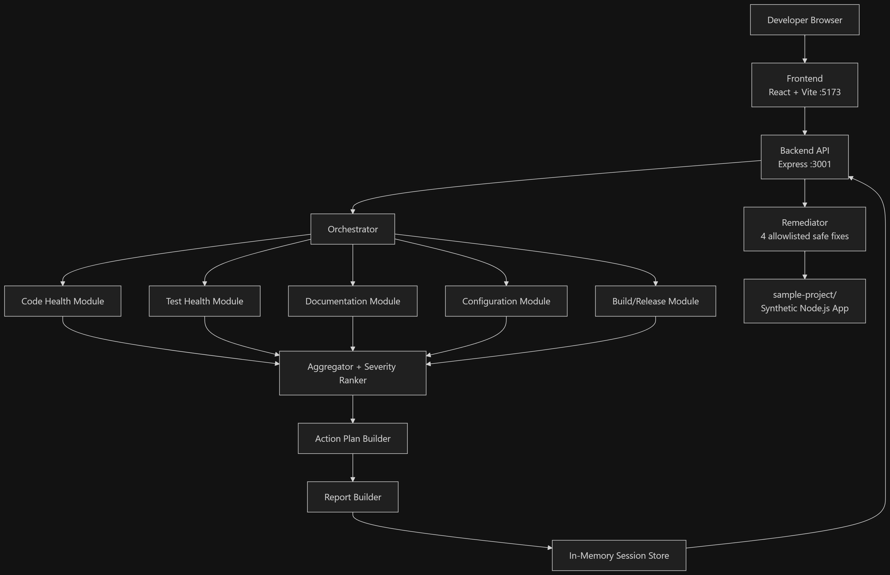

# DevFlow AI — Architecture

This document describes how DevFlow AI is put together. For the step-by-step
analysis pipeline and module-by-module checks, see [WORKFLOW.md](WORKFLOW.md).



## System Context

DevFlow AI analyses **one target project at a time**. In this repository the
target is `sample-project/`, a synthetic Node.js Express API with deliberately
seeded defects.

```
┌──────────────────────┐        HTTP / JSON        ┌──────────────────────┐
│  Browser             │  ◄──────────────────────► │  Express API        │
│  React + Vite SPA    │    :5173  →  :3001        │  (analysis engine)   │
│  :5173               │                            │                      │
└──────────────────────┘                            └──────────┬───────────┘
                                                                  │
                                                                  │ reads
                                                                  ▼
                                                       ┌──────────────────────┐
                                                       │  sample-project/     │
                                                       │  (analysis target)   │
                                                       └──────────────────────┘
```

The frontend is a pure client of the REST API. All analysis logic lives in the
backend; nothing is computed in the browser.

## Backend Layout

```
backend/src/
├── index.js              Entry point — starts the HTTP listener
├── server.js             Express app: JSON middleware, CORS, route mounting
├── models/types.js       JSDoc typedefs for Finding, ActionPlanItem, Session
├── store/
│   └── analysisStore.js  In-memory session/findings/plan/report store
├── engine/
│   ├── orchestrator.js   Runs modules, records timings, assembles results
│   ├── aggregator.js     Dedup + consolidation of duplicate findings
│   ├── severityRanker.js Severity rules and ordering
│   ├── actionPlanBuilder.js  Groups ranked findings into prioritised work
│   └── reportBuilder.js  Assembles the Release Readiness Report
├── modules/              The five analysis modules (independent)
├── remediation/
│   └── remediator.js     Four allowlisted, non-destructive fixes
└── routes/               analysis, findings, actionPlan, report, remediation
```

## Control Flow of One Analysis

1. `POST /api/analysis/start` validates `projectId` against the project
   allowlist, creates a session in the store, and returns the session id
   immediately with status `pending`.
2. `orchestrator.runAnalysis(sessionId)` is started **asynchronously** — the
   HTTP response does not wait for analysis to finish.
3. For each of the five modules the orchestrator:
   - marks the module `running` in the store,
   - awaits `module.analyze(projectPath)`,
   - records real start/completion timestamps and `durationMs`,
   - marks the module `completed` or `failed`.

   A module that throws is logged and skipped; it does **not** abort the run.
   The remaining modules still run.
4. All findings are aggregated (deduplicated, same-file marker counts
   consolidated), then severity-ranked and sorted.
5. Results are persisted to the store, the action plan is built, and the report
   is assembled — including a before/after comparison when the session has a
   parent session (i.e. it is a re-analysis).
6. The session is marked `completed` with `totalDurationMs`.

The frontend polls `GET /api/analysis/:id/status` to render live progress.

### Why the store is in-memory

Analysis state is only needed for the lifetime of a single-machine demo. A
database would add setup and failure modes without being observed by any
requirement. The trade-off is that sessions do not survive a server restart,
and the API is single-instance only.

## The Five Modules

Each module is an independent `analyze(projectPath) → Promise<Finding[]>`.
Modules never call each other, which is what makes them independently testable
and keeps the orchestrator as the only place that knows the sequence.

| Module | Reads | Executes |
|---|---|---|
| Code Health | `.js` source files | — |
| Test Health | test + source file layout | `npm test` |
| Documentation | `README.md`, `.env.example` | — |
| Configuration | `package.json`, `.gitignore` | — |
| Build / Release | `package.json` version, build script | `npm install`, `npm test`, `npm run build` |

`test-health` and `build-release` both run `npm test` — independently, so each
module can report its own timing rather than sharing one result.

## Finding Model

A finding is a plain object. Its consistent shape is what lets the aggregator,
ranker, plan builder and UI all work generically:

| Field | Purpose |
|---|---|
| `id`, `analysisId` | Identity and owning run |
| `category` | One of the five module keys |
| `severity` | `critical` / `high` / `medium` / `low` / `info` |
| `title` | Short human-readable summary |
| `explanation` | Why this matters |
| `affectedFile`, `affectedLine` | Where the issue is |
| `evidence` | Source snippet, truncated to 200 characters |
| `recommendation` | What to do about it |
| `remediable`, `remediationId` | Whether auto-fix applies, and which one |
| `status` | `open` or `fixed` |
| `_severityKey` | Internal hint used by the ranker for override rules |

## Action Plan Construction

Findings are grouped by the `severity:category` pair, groups are sorted by
severity then category name, and each group becomes one plan item carrying its
findings' ids, a rationale, an effort estimate, and an `automated` flag set
when any member finding is remediable. Findings already marked `fixed` are
excluded.

## Remediation Safety

`remediator.js` exposes exactly four operations, selected by a hardcoded
`remediationId` allowlist. Each is a file creation or a single-field JSON edit.
Paths are resolved and then checked to be inside `sample-project/`. An unknown
id is rejected with `400`, and no user-supplied string is ever passed to a
shell.

## Frontend Layout

```
frontend/src/
├── main.jsx              Mounts React, imports global CSS
├── App.jsx               Router definition
├── api/client.js         Typed helpers for every backend endpoint
├── components/layout/    Header
├── pages/                Dashboard, Analysis, Findings, ActionPlan, Report
└── styles/globals.css    Design tokens as CSS custom properties
```

State is held per page via the API client and polling; there is no global state
library, because a single active analysis session does not justify one.

## Security Model

The guarantees DevFlow actually makes:

- `projectPath` is validated against an allowlist — only `sample-project/` is
  accepted.
- Only `npm install`, `npm test` and `npm run build` can be executed, always
  with a command string assembled in source from hardcoded literals.
- A shell is used because `npm` resolves to `npm.cmd` on Windows and cannot be
  executed directly. The binary is chosen by a platform check, never by input.
  An earlier `execFile` + `shell: true` implementation was replaced because it
  caused Node to emit a `DEP0190` deprecation warning on every analysis run.
  Since no user input reaches these calls, there is no injection path today —
  but any future feature that builds a command from user input must revisit
  this first.
- Finding evidence is truncated to 200 characters, and the configuration module
  skips `.env` files entirely — only `.env.example` is read.

## Technology Choices and Rationale

| Choice | Why |
|---|---|
| Node's built-in `node:test` | No test framework dependency; works in backend and sample project alike |
| `execFile` with fixed arg arrays | Commands are auditable and allowlistable |
| In-memory store | No database needed for a single-machine demo |
| No state library on the frontend | One active session does not justify Redux/Zustand |
| Plain CSS custom properties | Matches the "no CSS framework" constraint; keeps the demo dependency-light |
| Vite proxy for `/api` | Frontend calls same-origin paths; no CORS complexity in dev |
